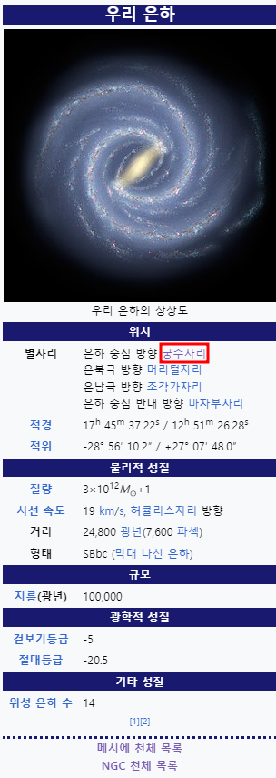
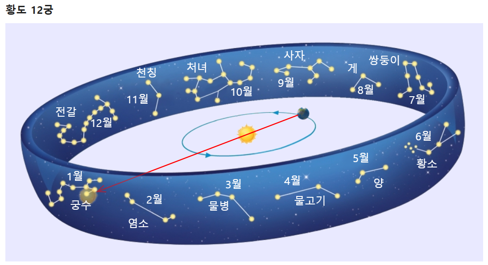

#
  
  

[위키-우리은하](https://javalab.org/zodiac/)
[위키-우리은하](https://ko.wikipedia.org/wiki/%EC%9A%B0%EB%A6%AC_%EC%9D%80%ED%95%98)
[나무위키-황도12궁](https://namu.wiki/w/%ED%99%A9%EB%8F%84%2012%EA%B6%81)
[나무위키-별자리](https://namu.wiki/w/%EB%B3%84%EC%9E%90%EB%A6%AC)

# 거리
우리은하▶12궁자리▶지구  
우리은하◀12궁자리◀지구  
ㄴ우리은하>>12궁자리  
ㄴ거리  

# 살짝이격
균등가정
ㄴ황도 12궁은 균등한 12등분
ㄴ그러나
ㄴ실제태양이머무는시간이
ㄴ비균등.
시간차이
ㄴ실제 태양이 지나가는 기간과의 차이
세차운동
ㄴ황도 12궁이 설정된 고대(약 2,000년 전)
ㄴ바빌로니아인은 기원전 2000년경부터 점성술을 발전시켰으며,
ㄴBCE 5세기경(약 2,500년 전) 황도 12궁 체계를 정립하였습니다.
ㄴ현행
ㄴ4천정도.
ㄴ차이날만하네.